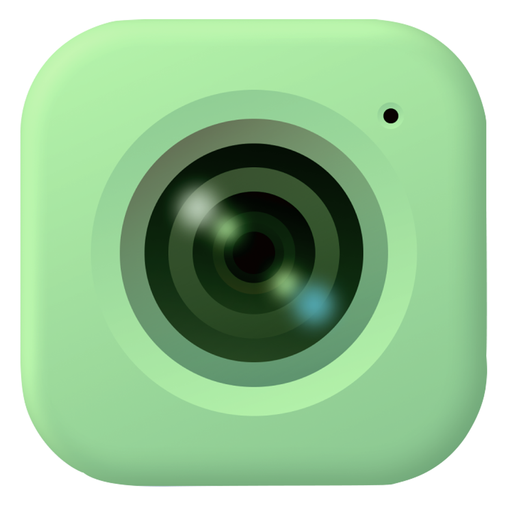

# 📸 CamCascade - Capture Every Moment in Perfect Quality



## Overview 💁🏻

**CamCascade** is a camera app made with **Flutter** and **Dart** and intended to ensure the seamless and reliable working of high-quality photo and video capture. Full of powerful features and an intuitive interface, it enhances the user's photography experience. Also, with built-in gallery support and settings management, it gives full control over all media and user preferences for the app.

**Transform your photography experience now!**

---

## 📷 Screenshots

### Light Mode ☀


---

### Dark Mode 🌙


---

---

## 🌟Key Features:

- 📸 **High-Quality Photo & Video Capture**: Capture stunning moments with exceptional clarity.
  🔦 Flashlight Support: Brighten up your shots in low-light conditions.

- 🎯 **Focus & Exposure Modes**: Take full control of focus and exposure for the perfect shot.

- 🖼️ **Built-in Gallery**: View, share, and manage your photos and videos effortlessly.

- 🗑️ **Media Management**: Delete unwanted photos and videos with just a tap.
  ℹ️ Media Info: Access detailed information about your captured content.

- 🧑🏻‍💻 **QR Code**: Qr code scanner that can scan the qr code and redirect to this link

## Additional Features:

- 📷 **Capture High-Quality Photos**
- 🎥 **Record HD Videos**
- 🔄 **Switch Between Front & Rear Camera**
- 🌙 **Dark & Light Mode Support**
- 🔦 **Flash Modes** – Auto, On, Off, and Torch
- 🖼️ **Thumbnail Preview** – View your last captured media
- 📂 **Save Media to Gallery** Automatically
- 📐 **Responsive UI** with Material Design
- 🚀 **Optimized for Performance**

## 🎨 Design & Behind the Scenes

- **Figma Design**: [View Design](https://www.figma.com/design/6xKXN2DvaOqtFVOFGPazSi/CamCascade?node-id=0-1&t=RYrjn5SftUaCkzLJ-1)
- **Development Process**: 

---

## 🛠️ Tech Stack

- **Flutter** – Cross-platform development
- **Dart** – Fast and efficient language
- **Camera Package** – Capture photos and record videos
- **Permission Handler** – Manage camera and storage permissions
- **Animated Splash Screen** – Splash screen animation
- **Provider** – State management
- **Shared Preferences** – Local storage
- **Flutter Screenutil** – Responsive UI across all devices
- **Mobile Scanner** – QR and barcode scanning
- **URL Launcher** – Open external links
- **Path Provider** – Access local file system
- **Photo View** – Interactive image viewer
- **Share Plus** – Share media and text
- **Gallery Saver** – Save captured media
- **Video Player** – Video playback
- **Audioplayers** – Audio playback

---

## 🚀 Installation Guide

### Prerequisites

- Install [Flutter](https://flutter.dev/docs/get-started/install)
- Set up your Flutter environment

### Steps

1. **Clone the Repository:**
   ```bash
   git clone https://github.com/naveddeveloper/camcascade.git
   ```

---

## 📂 Project Structure

```
CamCascade/
├── lib/
│   ├── main.dart             # Entry point of the application
│   ├── screens/              # Contains all the screens (UI)
│   │   ├── home_screen.dart
│   │   ├── gallery_screen.dart
│   │   └── setting_screen.dart
│   ├── widgets/              # Reusable widgets
│   │   └── bottom_toolbar.dart
│   │   └── custom_toast.dart
│   │   └── dialog_details.dart
│   │   └── recording_time.dart
│   │   └── row_bar_setting.dart
│   │   └── topleft_bar.dart
│   ├── providers/            # State management using Provider
│   │   ├── camera_provider.dart
│   │   └── theme_provider.dart
│   ├── utils/                # Utility classes and helper functions
│   │   └── get_filepath_uri.dart
│   │   └── sound_manager.dart
│   │   └── theme_preferences.dart
│   ├── styles/                # Styling and theme configuration
│   │   └── color.dart
│   │   └── theme.dart
├── assets/                   # Images, icons, and other assets
│   └── img/
│   │   └── cascadesplashicon.png
│   └── audio/
│   │   └── clicked.mp3
│   │   └── trash.mp3
│   │   └── videostart.mp3
│   │   └── videoend.mp3
├── pubspec.yaml              # Project configuration file
└── README.md                 # Project readme file
```

## Don't forget to :star: the repository.

## 🤝 Contributing

Pull requests are welcome! Feel free to fork this repository and submit a PR with your improvements.

## 📧 Contact Me

I'm the developer behind this project! You can check out more of my work here:

- 🌐 **GitHub**: [Your GitHub](https://github.com/naveddeveloper)
- 📩 **Email**: ansarinavedhabeeb@gmail.com
- 📷 **Instagram**: [Click to open my instagram account](https://instagram.com/naveddeveloper)

## Feedback 💬

If you have any suggestions, feel free to open an issue or contact me on [Instagram](https://www.instagram.com/naveddeveloper).

## Download the APK

[

## ⚖️ License

This project is licensed under the **MIT License**.

---

Unlock your creative potential and capture every moment with unmatched clarity and control.
